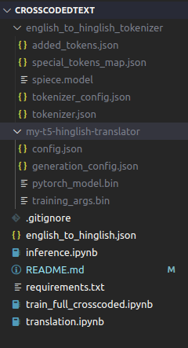

# Cross-Coded-Translation
## Introduction 
The problem statement given was a cross-coding translation task.
## What is cross-coding translation / text generation ?
### Cross coding translation that contain more than one script / language example...
Statement: I had about a 30 minute demo just using this new headset<br>
Output required: मझे सिर्फ ३० **minute** का **demo** मिला था इस नये **headset** का इस्तेमाल करने के<br>
लिए
### Complete cross-coding
There is another kind of cross coding -
Statement: I had about a 30 minute demo just using this new headset<br>
Output: Mujhe sirf 30 minut ka demo mila tha us naye headset ka istemal karne ke liye<be>
(The script is written in eenglish alphabets while keeping the pronunciation same)
## IDEA !! 💡💡 🧠
Notice in complete cross-coding 
Statement: I had about a 30 <ins>minute</ins> <ins>demo</ins> just using this new <ins>headset</ins> <br>
Output: Mujhe sirf 30 <ins>minute</ins> ka <ins>demo</ins> mila tha us naye <ins>headset</ins> ka istemal karne ke liye <br>
### In both statement and output the spellings are same
We take help of 2 different translation models to acheive this
- A pure translation model that translates from english to pure hindi
- A cross-coding text generation model<br>
Using the first model we find all the words that have same spelling in eglish as well as cross-coded hindi<br>
Then we create a dictionary of hindi words and their corresponding cross coded hindi eg.
```python
knowledge_base['मिनट'] = 'minute' # knowledge base 
knowledge_base['हेडसेट'] = 'headset'
```
Our goal is to  populate this knowledge_base as much as possible by using the above approach.
Once done use the second model to transalate and replace the words
### We will use synthetic data generated by chatgpt to populate the knowledge base
## Usage
```shell
git clone https://github.com/AkashParua/Cross-Coded-Translation.git
```
###  To train locally -
Use `train_full_crosscoded.ipynb` to train the algorithm for fully cross-coding translation model (tokenizer and translator)
### Alternatively 
Download [transalator](https://drive.google.com/file/d/1ekwzOLTV20sg2o_VLaCUBZAzxCuUzo-u/view?usp=sharing)<br>
Download [tokenizer](https://drive.google.com/file/d/1dpJNWn2nRMpTa2M5cqTWiCdLF3hnpyvc/view?usp=sharing)<br>
Extract the files<br>
Make sure the file structure is -<br>
